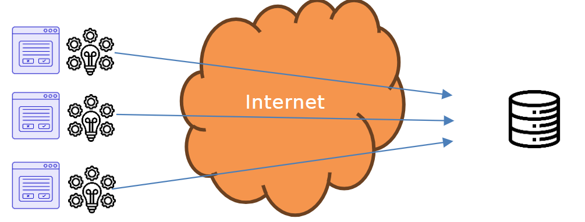
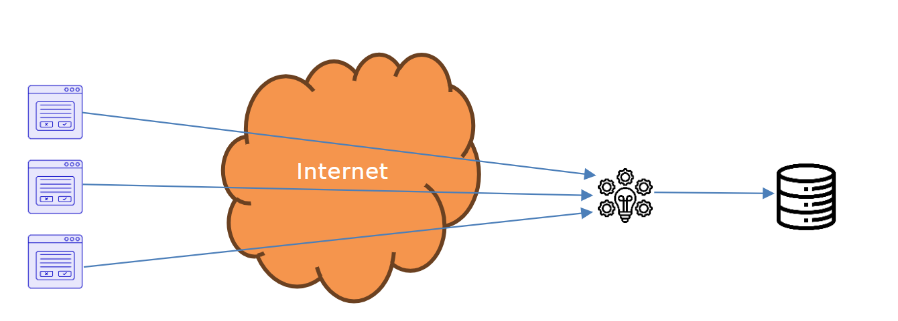

# Sicherheitsüberlegungen für die Architektur

## Ausgangslage
Sie haben mit der L-Bank eine simple Multiuser-Datenbank-Applikation
entworfen. Allerdings wurden da keine Sicherheitsüberlegungen gemacht.
In diesem Auftrag soll einleuchtend gezeigt werden, warum es eine Multitier-Architektur braucht.

Nehmen Sie an, Sie haben eine Applikation wie ein icket-Reservationssystem,
eine Bank, eine Dating-Applikation oder eine Schulverwaltungssoftware. 
Alle diese Applikationen haben folgende [Epics]() gemeinsam:

- Die Benutzer:innen sollen mit einer grafische Benutzerschnittstelle (GUI) arbeiten können.
- Alle Benutzer:innen sollen auf die gleiche Datenbasis Zugriff haben
(«greifen auf die gleiche Datenbank zu»)
- Die Zugriffe können gleichzeitig erfolgen.

## Aufgabenstellung
Bestimmen Sie eine korrekte und vernünftige Architektur.

### Teilaufgabe 1: Hypothese

Laut Aufgabenstellung haben Sie folgende Komponenten:
- Ein Programm, dass das GUI darstellt.
- Eine Business-Logik (dort, wo die Aufgaben erledigt werden: Buchungen in einer Konto-Applikation, Absenzen zählen in einer Schulverwaltung,Matches generieren in einer Dating-Applikation. Also dort «wo die Musik
spielt»).
- Eine Datenbank.
- Da Sie eine Datenbank haben, brauchen Sie noch ein Netzwerk

Ordnen Sie die Komponenten an, wie Sie denken, es würde Sinn ergeben und
verbinden Sie diese

GUI (3 Benutzer:innen):

Business-Logik:

Datenbank:

Es gibt noch eine Entscheidung, die Sie fällen müssen: Wie verbinden Sie sich zur Datenbank?

Sie haben zwei Möglichkeiten:

Variante 1: Jede/r Benutzer:in verbindet sich mit ein und demselben Benutzer auf die Datenbank, Sie programmieren die Authentifizierung und Autorisierung selbst.

Variante 2: Für jede/n Benutzer:in wird in der Datenbank ein eigener User
angelegt. Damit kann die Rechteverwaltung der Datenbank verwendet werden.
Grundsätzlich können Sie für BenutzerInnen die Rechte zum Zugriff auf Tabellen (einfügen, löschen, ändern des Schemas, …) geben

Beantworten Sie folgende Fragen zu Ihrer Hypothese:
- Wie kommen die Daten zur Datenbank?
- Was befindet sich auf den Rechner der Benutzer:innen?
- Was befindet sich auf einem Server?
- Welche Variante zur Verbindung haben Sie gewählt? Variante 1 oder 2?

### Teilaufgabe 2: Das Problem

Eine Möglichkeit wäre, ein Programm mit GUI zu programmieren, bei der die
Businesslogik auch gerade integriert ist, das über das Internet mit der
Datenbank Verbindung aufnimmt

Das Problem mit Variante 1:

Nehmen Sie an, es wird mit Variante 1 gearbeitet: Jede/r Benutzer:in verbindet sich mit ein und demselben Benutzer auf die Datenbank.

Der Username und der Benutzer müssen in der GUI-Applikation gespeichert
werden, sonst kann sie nicht auf die Datenbank zugreifen.

Es gibt nun aber die Möglichkeit, aus den «exe»-Dateien von .net-Programmen
den Quellcode zu gewinnen. Installieren Sie dotPeek5, einer der besten
Dekompilierer.

Laden Sie das Beispielprogramm 2-Tier-Security-Release herunter
und starten Sie es. [2-Tier-Security-Release](./Beispielprogramm/2-Tier-Security-Release.zip)

Starten Sie dotPeek und öffnen Sie die exe-Datei. Sie sehen den Quellcode.

Wählen Sie «2-Tier-Security», «_2_Tier_Security», «Form1» und dann «Form1.cs»

Fällt Ihnen etwas – für die Betreiber der Applikation – unangenehmes auf?
Was ziehen Sie daraus für Schlüsse?

Problem mit Variante 2

Nehmen Sie an, es wird mit Variante 2 gearbeitet: Für jede/n Benutzer:in wird in der Datenbank ein eigener User angelegt. In der Applikation wird ein Loginfenster gezeigt und so müssen keine Usernamen und Passworte in der
Applikation gespeichert werden.

Nun gibt es ein neues Problem. Nehmen Sie an, eine Benutzerin möchte etwas buchen:
Natürlich darf diese Person nur von ihrem eigenen Konto buchen! Der angelegte Benutzer muss aber das Änderungsrecht auf diese Tabelle haben, sonst kann gar nicht gebucht werden! Natürlich wird das vom GUI verhindert, aber was würden Sie als kreative/r Hacker:in vorschlagen?

### Teilaufgabe 3: Lösung

Frage: Welche Varianten für Username und Passwort sind denkbar?

Wieso haben wir die Probleme bei Variante 1 (jede/r Benutzer:in verbindet sich mit ein und demselben Benutzer auf die Datenbank) nicht?

Wieso haben wir die Probleme bei Variante 2 (für jede/n Benutzer:in wird in der Datenbank ein eigener User angelegt) nicht?

Schlechte Nachricht: Das wird komplex.

Gute Nachricht: Sie können Ihr Wissen aus dem Modul «295 Backend für Applikationen realisieren» anwenden.